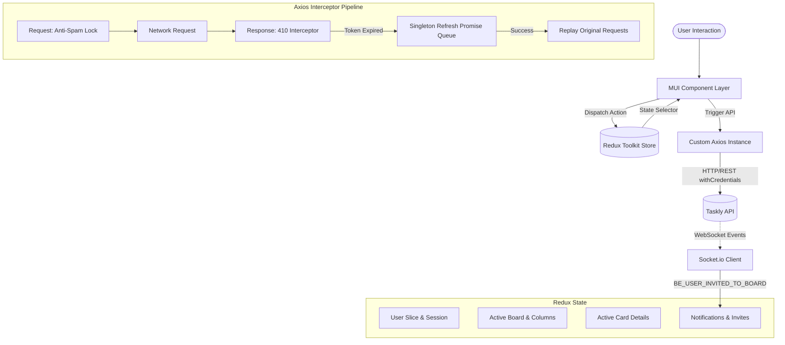

# Taskly — Collaborative Kanban Platform (Frontend Client)

[](https://react.dev/)
[](https://vitejs.dev/)
[](https://redux-toolkit.js.org/)
[](https://mui.com/)
[](https://dndkit.com/)
[](https://socket.io/)
[](https://axios-http.com/)
[](LICENSE)

> 💡 **Project Branding Notice:** This application is officially branded as **Taskly**. The repository directory is named `Trello_Clone` for development tracking.
> 
> 🔗 **Backend API Repository:** [Taskly RESTful API & Real-Time Server](https://github.com/tphatwebdev/Trello_Clone_API)

---

## 📌 Executive Summary

**Taskly Client** is an enterprise-ready, responsive, real-time Kanban project management web application inspired by Trello. Engineered with modern React 19, Vite, Redux Toolkit, and Material-UI, Taskly delivers a smooth, desktop-grade drag-and-drop workspace experience coupled with instantaneous socket-driven team collaboration.

The client-side architecture places heavy emphasis on **predictable state management**, **resilient network communication (silent JWT refresh token rotation with concurrency queueing)**, **custom sensory drag-and-drop mechanics**, and **pixel-perfect UX** across light and dark modes.

---

## 🌟 Key Features & Engineering Highlights

### 1. Multi-Directional Drag-and-Drop (DnD) Engine
- **Powered by `@dnd-kit`:** Highly accessible, lightweight, and extensible drag-and-drop interactions for both columns and cards.
- **Custom Sensors (`DndkitSensors.js`):** Configured with custom mouse and touch activation constraints (e.g., 10px distance threshold) to differentiate intentional drag operations from simple click/tap events, preventing accidental drags.
- **Optimistic UI Updates:** Columns and cards reorder instantaneously on the client while dispatching synchronization requests (`/v1/boards/:id` and `/v1/boards/supports/moving_card`) in the background.
- **Cross-Column Transfer Algorithm:** Handles moving cards across different columns smoothly, updating both source and destination ordering arrays atomically.

### 2. Real-Time Collaboration & Notification Center
- **Instant Socket.io Integration:** Connected to the backend WebSocket server for bidirectional event delivery (`BE_USER_INVITED_TO_BOARD`).
- **Interactive Notification Dropdown:** An AppBar notification bell equipped with an unread badge that pops up instant toast alerts and lets users **Accept** or **Reject** board invitations on the fly without refreshing the page.
- **Auto-Navigation:** Accepting a board invitation seamlessly transitions the user to the active board workspace.

### 3. Enterprise Authentication & Resilient HTTP Client
- **HttpOnly Cookie Architecture:** Access and refresh tokens are securely stored in HTTP-Only cookies, eliminating XSS token theft vectors.
- **Silent Refresh Token Rotation with Request Queueing:**
  - Implemented in `authorizeAxios.js` via Axios response interceptors.
  - When an access token expires (HTTP 410 / 401), a singleton `refreshTokenPromise` is created.
  - Any concurrent API requests triggered in the meantime are queued rather than failed, and replayed automatically once the new token arrives.
- **Redux Store Decoupling via Store Injection:** Uses an `injectStore` pattern to access Redux dispatch outside React components without causing circular dependencies.
- **Anti-Spam Click Interceptor:** Automatically disables trigger buttons during pending network requests to prevent duplicate submissions.

### 4. Rich Card Workspace Modal
- **Embedded Markdown Editor (`@uiw/react-md-editor`):** Allows writing full GitHub-flavored Markdown for task descriptions, sanitized against XSS attacks using `rehype-sanitize`.
- **Cloudinary Image Cover Upload:** Direct file upload integration with Cloudinary for visually striking card headers.
- **Team Assignment:** Add or remove board members to specific cards with live avatar indicators.
- **Real-Time Comment & Activity Stream:** Chronological feed tracking task updates and threaded discussions.

### 5. Board Dashboard & Workspace Management
- **Paginated Board Directory:** Server-side paginated dashboard with custom board creation modal (Public vs. Private board types).
- **Debounced Search:** Efficient board filtering via custom hook `useDebounceFn` to reduce unnecessary backend requests.
- **Member Management:** Add team members via email invite dialog with real-time invitation dispatch.

### 6. Modern Theming & Responsive Design
- **Material-UI (MUI v6) Design System:** Custom theme palettes supporting seamless **Light Mode** and **Dark Mode** toggling.
- Fully responsive layout adaptable from mobile screens to ultrawide monitors.

---

## 🏗️ Client Architecture & Data Flow



---

## 💻 Tech Stack & Dependencies

| Category | Technology | Purpose & Architectural Justification |
| :--- | :--- | :--- |
| **Core Framework** | React 19 + Vite | Next-gen reactivity, instant Hot Module Replacement (HMR), lightweight build outputs |
| **Routing** | React Router DOM v6 | Declarative client routing, nested layouts, protected route guards |
| **State Management** | Redux Toolkit & Redux Persist | Centralized single-source-of-truth, modular slices, persisted session caching |
| **UI Components** | Material-UI (MUI v6) & Emotion | Robust component primitives, centralized design token theme system |
| **Drag & Drop** | `@dnd-kit` (core, sortable, utilities) | Smooth performance, custom pointer distance sensors, accessible coordinate math |
| **HTTP Client** | Axios | Custom instance with token retry queueing, global toast notification, credentials support |
| **Real-time Engine** | Socket.io Client | Bidirectional WebSocket communication for real-time board collaboration |
| **Rich Text Editor** | `@uiw/react-md-editor` + `rehype-sanitize` | Markdown support for card descriptions and activity discussions with XSS security |
| **Form Handling** | React Hook Form | Uncontrolled input performance with declarative validation rules |
| **Feedback UI** | React-Toastify & Material-UI Confirm | Interactive dialogs and contextual notifications |

---

## 📁 Directory Structure

```
Trello_Clone/
├── public/                 # Static assets and favicon
├── src/
│   ├── apis/               # Centralized API service functions (Boards, Columns, Cards, Users, Invites)
│   ├── assets/             # SVGs, brand illustrations (404 astronaut, auth backgrounds)
│   ├── components/         # Reusable presentation and layout components
│   │   ├── AppBar/         # Global header, SearchBoards, Notifications, Profile Menu
│   │   ├── Form/           # FieldErrorAlert, ToggleFocusInput, VisuallyHiddenInput
│   │   ├── Loading/        # PageLoading and spinner components
│   │   ├── ModeSelect/     # Dark/Light theme mode selector
│   │   └── Modal/          # ActiveCard modal, Markdown editor, Activity section
│   ├── customHooks/        # Custom React hooks (useDebounceFn)
│   ├── customlib/          # Custom dnd-kit sensor configurations
│   ├── pages/              # Primary route views
│   │   ├── 404/            # Space-themed Not Found page
│   │   ├── Auth/           # Login, Register, and Account Verification views
│   │   ├── Boards/         # Workspace view (_id.jsx), BoardBar, BoardContent, Create Board Modal
│   │   ├── Settings/       # User profile (avatar upload) & security (change password)
│   │   └── Users/          # User management
│   ├── redux/              # Redux Toolkit store and slices
│   │   ├── activeBoard/    # Active board state, column/card ordering mutations
│   │   ├── activeCard/     # Modal card inspection state
│   │   ├── notifications/  # Real-time invitations and system alerts
│   │   ├── user/           # User authentication and session profile
│   │   └── store.js        # Root store configuration with redux-persist
│   ├── utils/              # authorizeAxios, constants, formatters, validators
│   ├── App.jsx             # Route definitions and authentication gatekeeper
│   ├── main.jsx            # Application entry point with Providers & Redux Store Injection
│   ├── socketClient.js     # Global Socket.io client instance
│   └── theme.js            # MUI custom design system palette and component overrides
├── eslint.config.js        # ESLint flat configuration
├── vite.config.js          # Vite build configuration with path aliases (~/)
└── package.json            # Project manifest and scripts
```

---

## ⚙️ Getting Started & Local Setup

### Prerequisites
- **Node.js**: `v18.x` or higher
- **Package Manager**: `npm` or `yarn` (recommended)
- **Backend API**: Running instance of [Taskly API Server](https://github.com/tphatwebdev/Trello_Clone_API)

### 1. Clone the Repository
```bash
git clone https://github.com/tphatwebdev/Trello_Clone.git
cd Trello_Clone
```

### 2. Install Dependencies
```bash
yarn install
# or
npm install
```

### 3. Environment Configuration
Create a `.env` file in the root directory:
```env
# Backend API Base URL
VITE_API_ROOT=http://localhost:8017

# WebSocket Server URL
VITE_SOCKET_SERVER=http://localhost:8017
```

### 4. Run Development Server
```bash
yarn dev
# or
npm run dev
```
Open your browser and visit: `http://localhost:5173`

### 5. Build for Production
```bash
yarn build
yarn preview
```

---

## 👨‍💻 Author & Contact

**Trần Tiến Phát** (tphatwebdev)
- **GitHub:** [@tphatwebdev](https://github.com/tphatwebdev)
- **Email:** [trantienphat13112004@gmail.com](mailto:trantienphat13112004@gmail.com)

---

## 📄 License
This project is open source and available under the [MIT License](LICENSE).
